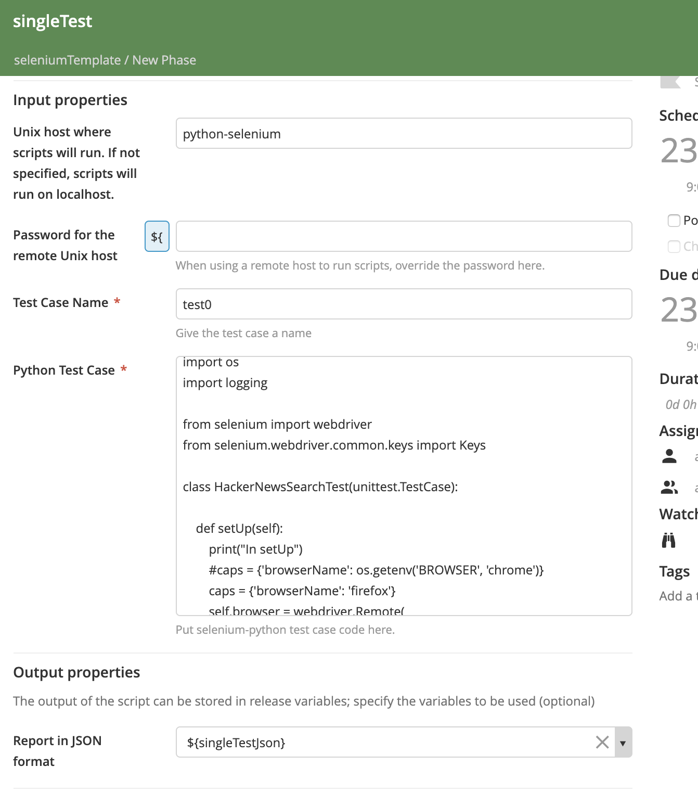
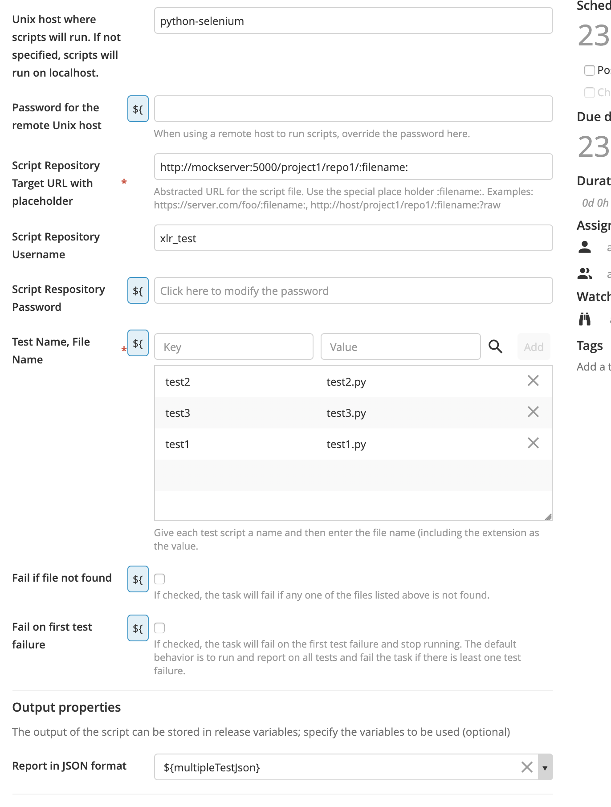
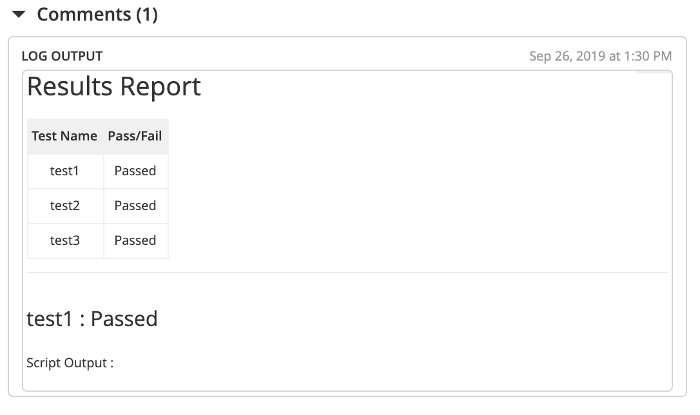

# xlr-selenium-plugin

[](https://travis-ci.org/xebialabs-community/xlr-selenium-plugin)
[![License: MIT][xlr-selenium-plugin-license-image]][xlr-selenium-plugin-license-url]
[![Github All Releases][xlr-selenium-plugin-downloads-image]]()

[xlr-selenium-plugin-license-image]: https://img.shields.io/badge/License-MIT-yellow.svg
[xlr-selenium-plugin-license-url]: https://opensource.org/licenses/MIT
[xlr-selenium-plugin-downloads-image]: https://img.shields.io/github/downloads/xebialabs-community/xlr-selenium-plugin/total.svg

# XL Release Selenium Plugin


## Preface
This document describes the functionality provide by the `xlr-selenium-plugin`

## Overview
This module offers a basic interface to Selenium functionality. The plugin will run python based selenium scripts on a remote host assuming the executing machine is configured with Selenium, Python and has access to the necessary Web Drivers (either locally or via Selenium Grid Hub). Scripts can be retrieved from any remote repository that can be accessed via URL or they can be entered singly, inline, into an XL Release task. The plugin code base includes an example testbed that uses docker to spin up the necessary servers for demonstration and testing purposes.

## Important Differences Between Version 1 and Version 2+
The Selenium-Python scripts used in version 2+ expect the desired_capabilites and command_executor arguments to be defined within the scripts themselves. The plugin no longer injects that information into the script. 

## Requirements

* **Requirements**
*  **XL Release**   9.0.0+

## Installation
*   Copy the latest JAR file from the [releases page](https://github.com/xebialabs-community/xlr-selenium-plugin/releases) into the `XL_RELEASE_SERVER/plugins/__local__` directory.
*   Restart the XL Release server
*   Optionally, within XL Release->Settings->Shared Configurations, configure a UNIX Host server - the remote location where the scripts will run. This host must be configured with Selenium, Python and must have access to the necessary Web Drivers (either locally or via Selenium Grid Hub). Using a host is recommended because it obviates the need to install Python and Selenium on the XL Release server. 


## Available Tasks

### Run a Single Selenium Test Case

The **Selenium: Run Single Python Test Case** task type runs single script either remotely or locally.



1.  If executing the script remotely, choose the Unix Host from the drop down list. 
2.  If necessary, you can override the Unix Host password in the password field
3.  Give the test a descriptive name.
4.  Copy the full script into to the 'Python Test Case' field.
5.  Optionally, create a new variable or chose an existing variable of type Text to hold the test results.

### Example Script

```python
import time
import unittest
import os
import logging

from selenium import webdriver
from selenium.webdriver.common.keys import Keys

class PythonOrgSearchTest1(unittest.TestCase):

    def setUp(self):
        print("In setUp")
        caps = {'browserName': 'firefox'}
        self.browser = webdriver.Remote(
            command_executor='http://hub:4444/wd/hub',
            desired_capabilities=caps)
        self.logger = logging
        self.logger.info("About to call a test")

    def test_simple(self):
        print("In simple")
        self.logger.info("In simple")
        browser = self.browser
        browser.get('http://www.python.org')
        self.assertIn("Python", browser.title)
        search_box = browser.find_element_by_name('q')
        search_box.send_keys('pycon')
        search_box.send_keys(Keys.RETURN)
        time.sleep(3) # simulate long running test
        self.assertIn('pycon', browser.page_source)

    def tearDown(self):
        print("In tearDown")
        self.browser.quit() # quit vs close?


if __name__ == '__main__':
    logging.basicConfig(filename='/selenium-plugin.log',level=logging.INFO)
    logging.info("About to call main")
    unittest.main()
```

### Run One or More Tests Retrieved from a Remote Repository

The **Selenium: Run Scripts Retrieved From Repository** task type runs one or more scripts either remotely or locally. The scripts must be stored in a repository that is accessable via a URL. The size limit for a script has been set at 200,000 characters.  



1.  If executing the script remotely, choose the Unix Host from the drop down list. 
2.  If necessary, you can override the Unix Host password in the password field
3.  Enter a URL template for the location from which the file or files will be retrieved. This URL must contain the literal string :filename: as a placeholder for the script file name.  For example - https://server.com/foo/:filename:  or http://host/project/repo1/:filename:?raw
4.  Enter a list of test name / file name pairs. 
5.  If a listed file is not found, the default behavior is to continue on with the task and retrieve the next file in the list. If 'Fail if file not found' is checked, however, the task will fail if a listed file is not retrieved.
6.  The default behavior is to process and report on all tests even if some fail along the way. The task itself will fail and exit at the end if any test fails. If 'Fail on first test failure' is checked however, the task will fail and exit upon the first test failure. 
7.  Optionally, create a new variable or chose an existing variable of type Text to hold the JSON formatted test results.


### Task Output
Both tasks produce results in both JSON and Markdown format. The JSON object for each test contains the testname(as defined in the task), result(Passed or Failed), output(Output produced by print statements within the individual scripts), and additionalStream(contains the success stream or the error stream from the remote Unix host and the Selenium Grid Hub). The Markdown report displays the testname and result (Passed/Failed) for each test in table format followed by a listing of the output and additional stream for each test. 




## References:
* [Selenium WebDriver](http://www.seleniumhq.org/projects/webdriver/)

## Develop and Demo

Build and package the plugin with...

```bash
./gradlew build
```

### To run integration tests - 
1.  You will need to have Docker and Docker Compose installed 
2.  The XL-Release image expects to find a valid XL-Release license on your machine, at this location: ~xl-licenses/xl-release-license.lic
3.  Open a terminal in the root of the xlr-selenium-plugin project and run the test - 

```bash
./gradlew clean integrationTest
```
    
The test will set up a temporary python-selenium/selenium grid hub/xlr/selenium firefox node/selenium chrome node/mockserver testbed using docker. NOTE: The integration tests take about 5 minutes to run. 
1. The python-selenium container - this is where the python-selenium scripts with run. This makes it possible to run python-selenium scripts from xl-release without having to install python and selenium on the xlr server itself. 
2. Selenium Grid container - this hub manages further execution of the tests on nodes that have been configured with various browser drivers 
3. Firefox node - this container is used to run tests configured to test against the Firefox browser
4. Chrome node - this container is used to run tests configured to test against the Chrome browser
5. The mock server is used to act as a script repository. Integration tests set up to invoke the XLR Selenium task named 'Run Scripts Retrieved From Repository' will retrieve the scripts from the mock server
6. After testing is complete, the test docker containers are stopped and removed. 

### To run demo or dev version (set up the docker containers and leave them running) -
1.  For requirements, see the 'To run integration tests' above
2.  Build the xlr-selenium-plugin.jar - Open a terminal and cd into <xlr-selenim-plugin code base> and run ./gradlew clean build . Be sure to re-run the command whenever code is changed. 
3.  From another terminal, cd into the <xlr-selenim-plugin code base>/src/test/resources/docker/  directory. 
4.  Run (necessary the first time only): docker-compose build
5.  Then run: docker-compose up -d 
6.  XL Release will run on the [localhost port 15516](http://localhost:15516/). It may take up to a minute for XL Release to start up
7.  The XL Release username / password is admin / admin
8.  After XL Release has started, you can set up a template and shared configuration server by running the script <xlr-selenim-plugin code base>/src/test/resources/docker/initialize/initialize_data.sh. Alternatively, follow the steps below:
    1.  within XL Release->Settings->Shared Configurations, configure a Unix Host with the following attributes:
        1.  Title -> python-selenium
        2.  Conection Type -> SUDO
        3.  Address -> python-selenium
        4.  Port -> 22
        5.  Username -> root
        6.  Password -> xebialabs
    2.  Within XL Release, navigate to the Templates page and use the import feature to import the template located here: <xlr-selenim-plugin code base>/src/test/resources/docker/initialize/data/release-template-selenium.json .
9.  You can now run a release based the template named 'seleniumTemplate'.
10. When code is modified, re-run the ./gradlew clean build (in the first terminal), then refresh the testbed by running docker-compose down followed by docker-compose up -d (in the second terminal) and after XL Release starts up, re-import the server configuration and the template

Further Demo/Dev Notes:
1. The log file for the plugin - selenium-plugin.log will be persisted to the local directory <xlr-selenim-plugin code base>/build/reports/tests/log directory.
2. The Mockserver runs on the [localhost port 5099](http://localhost:5099/)
3. The example script files used in the demo are located in the <xlr-selenim-plugin code base>/src/test/resources/mockserver/responses directory
4. If you add example scripts, be sure to rebuild the mockserver docker image

