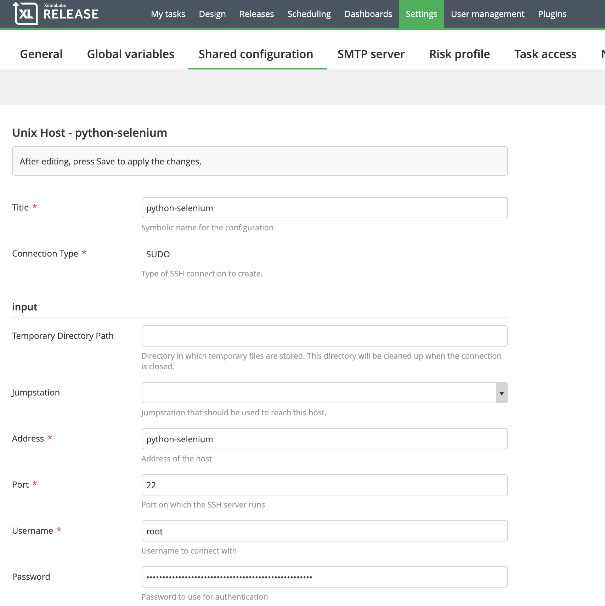

# xlr-selenium-plugin

[](https://travis-ci.org/xebialabs-community/xlr-selenium-plugin)
[![License: MIT][xlr-selenium-plugin-license-image]][xlr-selenium-plugin-license-url]
[![Github All Releases][xlr-selenium-plugin-downloads-image]]()

[xlr-selenium-plugin-license-image]: https://img.shields.io/badge/License-MIT-yellow.svg
[xlr-selenium-plugin-license-url]: https://opensource.org/licenses/MIT
[xlr-selenium-plugin-downloads-image]: https://img.shields.io/github/downloads/xebialabs-community/xlr-selenium-plugin/total.svg

# XL Release Selenium Plugin


## Preface
This document describes the functionality provide by the `xlr-selenium-plugin`

## Overview
This module offers a basic interface to Selenium functionality. The plugin will run python base selenium scripts on a remote host or locally as long as the executing machine is configure with Selenium, Python and has access to the necessary Web Drivers (either locally or via Selenium Grid Hub). Scripts can be retrieved from any remote repository that can be accessed via URL. The plugin code base includes an example testbed that spins up the various servers for demonstration and testing purposes.

## Important Differences Between Version 1 and Version 2+
The Selenium-Python scripts used in version 2+ expect the desired_capabilites and command_executor arguments to be defined within the scripts themselves. The plugin no longer injects that information into the script. 

## Requirements

* **Requirements**
*  **XL Release**   8.5.0+

## Installation
*   Copy the latest JAR file from the [releases page](https://github.com/xebialabs-community/xlr-selenium-plugin/releases) into the `XL_RELEASE_SERVER/plugins/__local__` directory.
*   Restart the XL Release server
*   Within XL Release, configure a UNIX Host server - the remote location where the scripts will run. This host must be configured with Selenium, Python and must have access to the necessary Web Drivers (either locally or via Selenium Grid Hub).




## Available Tasks

### Run a Single Selenium Test Case

The **Selenium: Run Single Python Test Case** task type runs single script either remotely or locally.


1.  Choose the Unix Host from the drop down list, if executing the script remotely. 
2.  Give the test a descriptive name.
3.  Copy the full script into to the 'Python Test Case' field.
4.  Optionally, create a new variable or chose an existing variable of type Text to hold the test results.

### Example Script

```python
import time
import unittest
import os
import logging

from selenium import webdriver
from selenium.webdriver.common.keys import Keys

class PythonOrgSearchTest1(unittest.TestCase):

    def setUp(self):
        print("In setUp")
        #caps = {'browserName': os.getenv('BROWSER', 'chrome')}
        caps = {'browserName': 'firefox'}
        self.browser = webdriver.Remote(
            command_executor='http://hub:4444/wd/hub',
            desired_capabilities=caps)
        self.logger = logging
        self.logger.info("About to call a test")

    def test_simple(self):
        print("In simple")
        self.logger.info("In simple")
        browser = self.browser
        browser.get('http://www.python.org')
        self.assertIn("Python", browser.title)
        search_box = browser.find_element_by_name('q')
        search_box.send_keys('pycon')
        search_box.send_keys(Keys.RETURN)
        time.sleep(3) # simulate long running test
        self.assertIn('pycon', browser.page_source)

    def tearDown(self):
        print("In tearDown")
        self.browser.quit() # quit vs close?


if __name__ == '__main__':
    logging.basicConfig(filename='/selenium-plugin.log',level=logging.INFO)
    logging.info("About to call main")
    unittest.main()
```

### Run One or More Tests Retrieved from a Remote Repository

The **Selenium: Run Scripts Retrieved From Repository** task type runs one or more scripts either remotely or locally. The scripts must be stored in a repository that is accessable via a URL. 


## References:
* [Selenium WebDriver](http://www.seleniumhq.org/projects/webdriver/)
